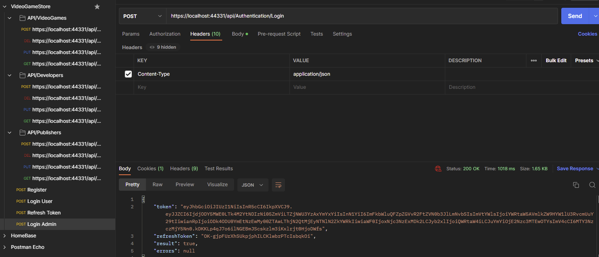
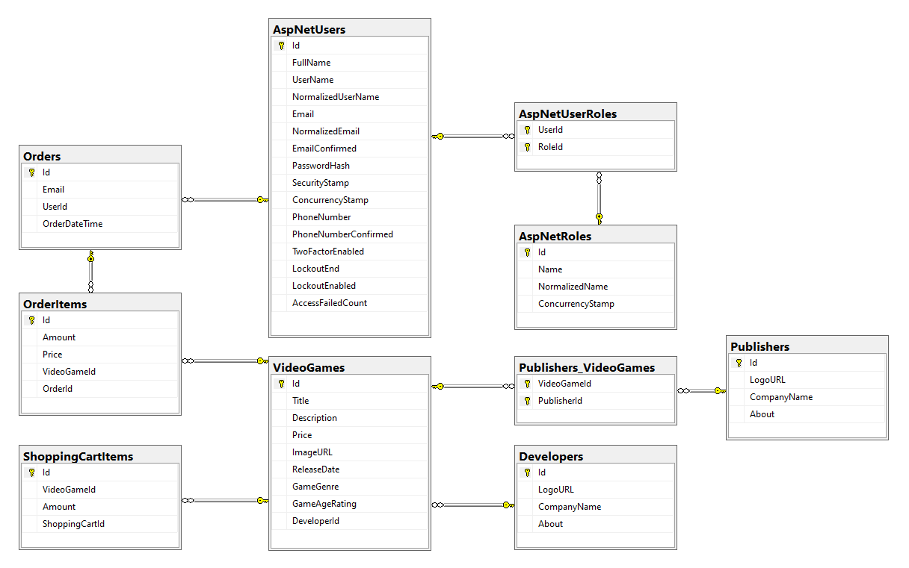

# VideoGameStore

<a name="readme-top"></a>

This is a ASP.NET MVC project designed to perform the functionality of a video game store. I created this as a way to improve my coding skills while applying for jobs. All functionality can be performed via the front end or by JWT verified API CRUD operations. This is a work in progress and not intended to be used in a production environment.

## Author
### Garrett Roach 
[![LinkedIn][linkedin-shield]][linkedin-url]


## GIF User Interface:
[](https://github.com/Groach5000/VideoGameStore)

## JWT testing on Postman:
[](https://github.com/Groach5000/VideoGameStore)

## DB Diagram:
[](https://github.com/Groach5000/VideoGameStore)

### Installing
Modifications needed to be made to files/folders:
1. The DefaultConnectionString in appsettings.json will have to be updated with your own local DB connection string.
   - Then in the "Package Manager Console", perform the following command:
     - PM> Update-Database
```json
   "ConnectionStrings": {
    "DefaultConnectionString": "Data Source=(localdb)\\MSSQLLocalDB;Initial Catalog=VideoGameStore-DB;Integrated Security=True"
  }, 
```
## License
This project is licensed under the MIT License - see the [LICENSE.md](LICENSE.md) file for details

[linkedin-shield]: https://img.shields.io/badge/-LinkedIn-black.svg?style=for-the-badge&logo=linkedin&colorB=009
[linkedin-url]: https://www.linkedin.com/in/garrett-roach-indiana/
